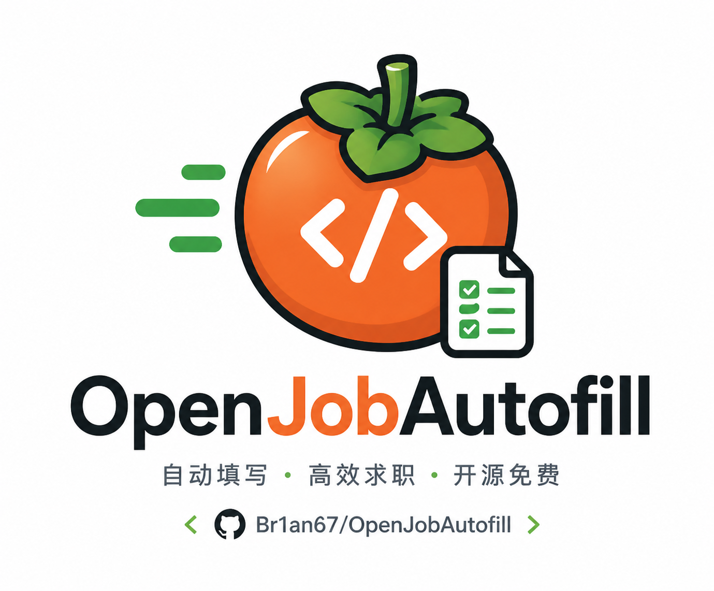

# OpenJobAutofill

[English README](README.en.md)

  

OpenJobAutofill 是一个带 AI 页面分析能力的网申表单填写扩展。你只需要在本机维护一份简历资料，之后打开招聘网站，点击 `开始填写`，它会扫描当前页面，用本地规则和可选 AI 理解字段含义，把能确定的内容填进表单，其他字段标为待处理。

它的重点不是“全自动投递”，而是把 AI 用在最适合的地方：理解不同网站五花八门的字段名称和页面结构，同时把简历具体内容留在本机。个人信息、教育经历、实习经历、项目经历、证书、奖项这些反复填写的内容，都可以交给它先填一遍。最后仍由你自己检查并提交。

如果这个项目帮你节省了网申时间，欢迎给仓库点一个 Star。开源不易，你的反馈也会帮助我继续优化更多招聘网站的兼容性。

## 功能亮点

- 设置页与弹窗采用 Electric Studio 主题，内置 Manrope 字体，保持净白、清晰、克制的本地工具体验。
- 一键扫描当前招聘页面，自动填写能确定的字段，其他字段标为待处理。
- 简历资料只保存在本机，不需要把个人信息上传到云端。
- 支持常见输入框、文本域、单选、多选、下拉框和日期类字段。
- 内置可复用的控件适配层：原生控件、Layui（含隐藏 `select` 与 `dd[lay-value]` 代理下拉）、Ant Design、Element UI、Arco Design 和 TDesign；控件适配与招聘站点适配分开维护。
- 资料面板跟随 Electric Studio 主题，可以按分类查看和搜索；每个资料条目都支持一键复制，以及直接编辑并保存到本机资料。
- 可选接入 OpenAI 兼容 API 或自定义 API，帮助理解不同网站的字段含义。
- AI 只辅助识别页面字段和可匹配的资料项，不接收你的简历具体值。
- 页面填写结果会用两种颜色标记：绿色已填写，橙色待处理。

## 安装

当前版本适合以开发者模式安装到 Brave 或 Chrome。

1. 下载或克隆本项目到本机。
2. 打开 `brave://extensions/` 或 `chrome://extensions/`。
3. 开启右上角 `Developer mode`。
4. 点击 `Load unpacked`。
5. 选择项目目录 `OpenJobAutofill`。
6. 固定扩展图标，方便在招聘页面使用。

本项目不需要安装依赖，也不需要构建，加载项目目录即可使用。

## 两台电脑同步插件版本

### 1.1.7：HotJob 表单适配

支持 HotJob 的 `.form-cell` 栏目和 `.form-cell-inner` 经历条目边界，识别必填星号、第一专业、企业名称、工作描述、项目职责、GPA 绩点等名称，并拆分“证书等级”中的语种/证书两个下拉框。

已有教育、实习和项目条目优先根据学校/企业/项目名称与本机资料唯一对应，支持项目子集及顺序不同的页面；名称重复或未知时不会按序号套用另一条资料。此约束同时作用于本地规则和 AI 匹配。学校同名的多段教育经历暂需手动确认。

旧版 Ant Design 下拉框只在自己的关联选项中精确匹配，保留 CET-4/CET-6 等数字差异，选择后检查显示的选中值。正文的部分重合不再被认作完整填写。只读日历暂不自动操作，会提示手动选择；附件、校区等缺少可靠映射的内容仍需自行确认。

本次使用已填写页面进行只读结构检查，并用脱敏模拟条目执行回归测试，没有对在线简历执行填写或提交。开发者模式安装更新后，需要在扩展管理页点击“重新加载”；已填写页面如需刷新，请先确认网站已保存内容。

### 更新方式

如果不通过 Chrome Web Store，可以让两台电脑都从同一个 GitHub 仓库的 `main` 分支更新。插件代码会保持一致，但简历资料、API 设置、备份历史和调试日志仍分别保存在各自浏览器的 `chrome.storage.local`，不会被这些脚本同步。

首次配置要求：

1. 两台电脑都使用 `git clone` 获取本仓库，而不是只下载 ZIP。
2. 在浏览器扩展管理页中，从各自克隆得到的 `OpenJobAutofill` 目录加载已解压扩展。
3. 以后在主要开发电脑上完成修改、提交并推送到 `origin/main`。

更新另一台电脑：

- macOS：双击 [`scripts/Update-OpenJobAutofill.command`](scripts/Update-OpenJobAutofill.command)。
- Windows：双击 [`scripts/Update-OpenJobAutofill.cmd`](scripts/Update-OpenJobAutofill.cmd)。`.cmd` 会调用同目录下的 PowerShell 更新器。

更新器会检查当前分支和工作区状态，只执行 `git pull --ff-only origin main`。如果存在未提交或未跟踪的文件，它会停止并显示文件列表，不会自动覆盖、删除或暂存任何内容。更新完成后会显示插件版本并打开 Chrome、Brave 或 Edge 的扩展管理页。

最后在扩展管理页找到 OpenJobAutofill，点击 `重新加载`，再刷新正在填写的招聘页面。不要为了升级而删除扩展或改用另一个目录重新安装；在原扩展卡片上重新加载，才能稳妥保留这台电脑已有的本机资料。

## 第一次使用

1. 点击浏览器右上角的 OpenJobAutofill 图标。
2. 点击 `设置`。
3. 在 `简历资料` 中按模块填写你的信息。
4. 点击 `保存资料`，资料会保存到本机浏览器扩展存储。
5. 打开招聘网站的简历填写页或申请表单页。
6. 点击扩展图标，再点击 `开始填写`。
7. 等待扫描和填写完成，根据页面上的绿色/橙色标记检查结果。
8. 对橙色待处理字段，可以打开资料面板搜索；每个条目都可以一键复制，或直接编辑后保存。
9. 最后由你自己确认页面内容并手动提交。

如需在工作区维护固定资料文件，请使用被 Git 忽略的 `local-profile/profile.json`，并遵循[本机资料维护说明](docs/local-profile.md)。更新时保留自定义字段，不再维护多个日期命名的副本。

项目里提供了 `sample-profile.json`，如果你只是想先试一下效果，可以在设置页导入这份示例资料。

## AI 设置

AI 是可选的。不配置 API 时，OpenJobAutofill 仍会使用本地规则尝试匹配和填写字段。

如果你希望它更好地理解不同招聘网站的字段，可以在设置页填写自己的 API 配置。支持 OpenAI 兼容接口，也支持自定义 Base URL、接口路径和模型名。设置页提供 `测试 API 连接` 和 `刷新候选模型`，模型名也可以手动输入，不强依赖自动加载结果。

隐私边界很明确：AI 请求只包含当前页面字段和本机资料字段名称，不包含你的姓名、手机号、身份证号、经历内容等具体资料值。真正的资料取值和填写都在本机完成。

## 颜色标记

- 绿色：已填写。
- 橙色：待处理，需要你手动处理或复核。

如果页面刷新、进入下一步或动态加载出新的表单，可以再次点击 `开始填写`。

## 隐私说明

- 简历资料保存在本机浏览器里。
- API Key 也只保存在本机扩展存储里。
- 页面脚本只会在你点击扩展并操作当前页面后注入。
- 插件不会自动点击最终提交按钮。
- 插件不会把你的简历具体内容发送给 AI。
- 页面自动填写后仍建议人工复核，尤其是证件、联系方式、日期、选择题和声明类字段。

## 常见问题

### 点击开始填写没有反应

先刷新目标页面，再重新打开扩展弹窗。如果仍无反应，可以到扩展管理页重载 OpenJobAutofill。

### 为什么有些下拉框或日期填不进去

不同招聘系统的控件实现差异很大。有些控件不是普通输入框，而是复杂组件。当前版本会优先使用控件适配器：Layui 会把隐藏的原生 `select` 和可见代理下拉关联起来，并等待异步选项；其他未覆盖的自定义控件仍可能进入待处理状态，可以用资料面板搜索对应内容并手动选择。如果某类网站经常需要手动处理，欢迎提 Issue，我会优先看可复用的适配方式。

### 多页表单怎么填

每进入一个新页面或新步骤后，再点击一次 `开始填写`。OpenJobAutofill 不会自动跨页面继续填写，也不会自动提交申请。

### 如何备份或迁移资料

每次保存资料时，插件会在当前浏览器中保留一个去重的历史版本，最多保留最近 10 份，可以在设置页的“资料备份保险”中恢复。

建议在“资料备份保险”中开启 `自动备份到下载目录`。开启时浏览器会单独请求下载权限；之后每次保存资料，都会把当天最新版写入下载目录下的 `OpenJobAutofill/backups/`。这些文件不会在移除扩展时被删除，但包含你的简历个人信息，请只保存在可信设备。

也可以使用 `另存一份备份` 生成带精确时间的独立 JSON 文件，或使用 `导入资料备份` 从文件恢复。备份只包含简历资料，不包含 API Key 等敏感 API 配置。

### 如何清空本机资料

进入设置页，点击 `清空资料和 API 设置`。这会删除当前浏览器里保存的简历资料、API 配置和内部版本历史；已经下载到磁盘的独立备份不会删除。

## 反馈

如果你遇到问题、希望适配某个招聘网站，或者有功能建议，欢迎直接提 Issue。反馈时尽量附上网站名称、页面截图、待处理字段描述，这样更容易定位问题。

也可以到我的 GitHub 主页查看公开邮箱联系我。

友情链接：[LINUX DO](https://linux.do) - 一个面向技术爱好者的中文社区，本项目链接并认可 LINUX DO，欢迎佬友交流和反馈。

## License

OpenJobAutofill 使用 MIT License 开源。详见 [LICENSE](LICENSE)。
